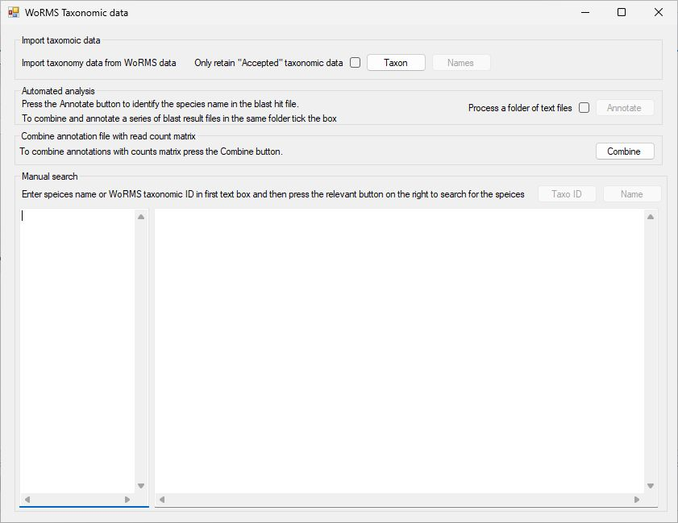
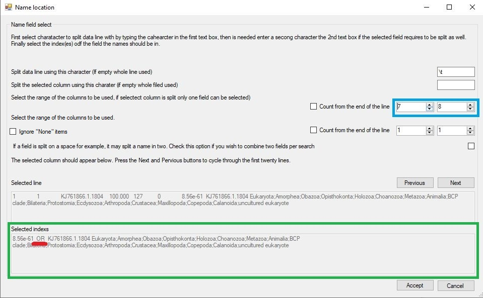
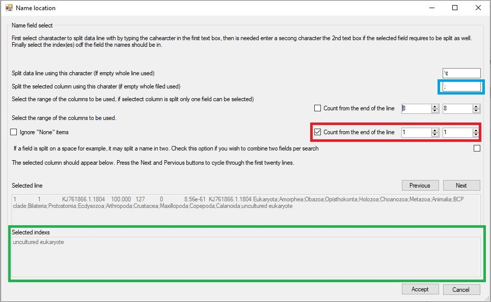
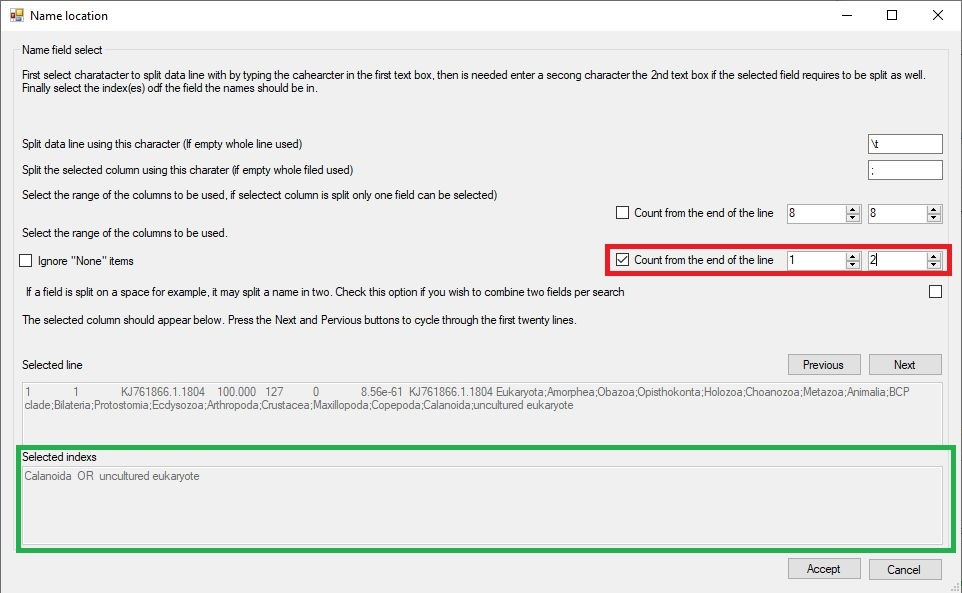
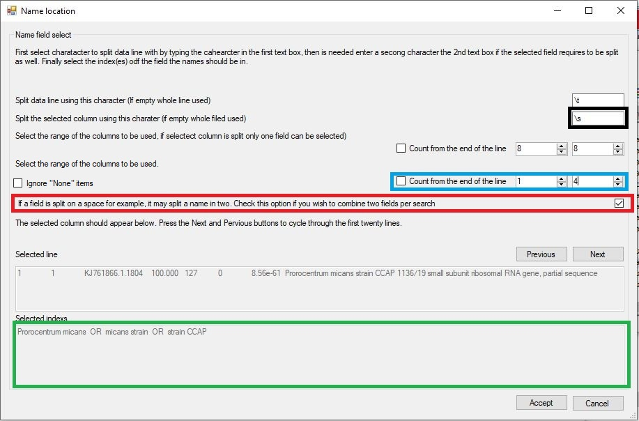
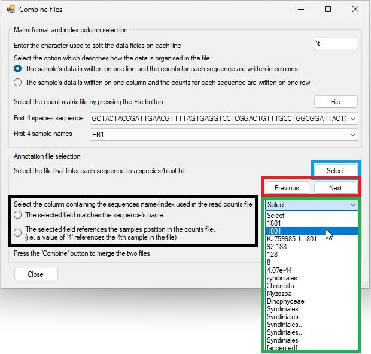

# Annotating read count matrixes with taxonomic data with ```Taxonomy WoRMS```

## Prerequisites 

### NCBI taxonomy data
```Taxonomy WoRMS``` annotates files using taxonomic data downloaded from the WoRMS taxonomy [webpage](https://www.marinespecies.org/). While the data is freely available via a web interface, you will need to register to download the raw data. This resource is regularly updated so you should download a fresh copy each month for an on going project and then archive a version for completed projects for which you no longer in tend to analyse the data, such that it could be repeated when responding to reviewers comments without getting any unwanted results due to changes in the data. Of the files in the dataset you only need the taxon.txt and vernacularname.txt. 

### Read counts matrix file
There are a number of programs that can determine the number of reads linked to specific sequences in a series of sample files. ```Taxonomy WoRMS``` is able to process read count matrix files where the rows and columns represent the samples and sequences  as well as files where the rows and columns represent sequences and samples. However, it expects the first row and column contain the data's IDs. ```Taxonomy WoRMS``` does not convert the read count values in to any number type so they can be decimal or integer values.

### Blast hit file
The blast hit file can have just about any character delimited format, but was tested on blastn results formatted with the outfmt 5 option for example: 

> $blastn -query inputFile.fasta -db databaseName -dust no -outfmt 6 -num_alignments 10 -num_threads 2 > results.txt"

The command returns the best 10 hits since many databases not contain sequence with names such as __uncultured sample__ or __environmental sample__ that have no relevant taxonomic information. If you have 10 hits, hopefully one hit will have links to a species or family. The query sequence id in the blast hit can link to species data in the matrix file by having the same name or by the value in the blast results file is a number that corresponds to the sequence's position in the matrix file(i.e. if the blast hit qseqid value is 4, the same sequence is represented as the 4th sequence in the matrix file. Figure 1)


Figure 1: The qseqid value of 4 links to the 4th sequence data column in the matrix file. (the first column is the sample name column so the numbering starts column B)

<hr />

## ```Taxonomy WoRMS```

### Running on non-Windows PCs

```Taxonomy WoRMS``` is written in C# which as strong links to Windows computers, but can be used on macOS ot Linux/BSD computers using Wine as described [here](https://github.com/msjimc/RunningWindowsProgramsOnLinux).

## The user interface

Figure 2 shows the ```Taxonomy WoRMS``` user interface which consists of 4 regions: [```Import Taxonomic data```](#importing-and-saving-the-ncbi-taxonomic-data), [```Automated analysis```](#annotating-a-blast-hit-file-with-ncbi-taxonomic-data), [```Combine annotation file read count matrix```](#combining-the-annotated-blast-hit-file-and-the-read-count-matrix-file) and [```Manual search```](#manually-searching-the-taxonomy-data).



Figure 2 the user interface.

### Importing the WoRMS taxonomic data

The taxonomic data from the WoRMS website is present in two files. The taxon.txt contains the taxonomic id of each taxonomic grouping (i.e. each species, family or clade) with its latin name and ancestor terms of kingdom, phylum, class, order, family, genus, subgenus, specificEpithet	infraspecificEpithet. The names.dmp file contains the common names for each species of which only the English terms are used.

Due to differences in annotation, ```Taxonomy WoRMS``` will use a number of latin names for the same species for instance the sea snail ***Cymbiola nobilis*** will also be linked to the scientific name ***Cymbiola (Cymbiola) nobilis nobilis***	as well as ***Cymbiola nobilis nobilis***.


Pressing the ```Nodes``` in the ```Import taxonomic data``` panel, allows you to select the taxon.txt file which it then imports, linking each term to its parent to form a tree where a species is a leaf while the roots are the terms like ***Eukaryota***. While importing the data the status is given in the windows title bar. When the data has been imported the title will return to ```Taxonomy WoRMS``` and the ```Names``` button will be activated. 

Pressing the ```Names``` button will allow you to select and import the vernacularname.txt file. This will add the common English names to the nodes previously imported. Again, the status is shown in the title bar and when completed the title will revert to ```Taxonomy WoRMS``` and the program is now ready to be used.

### Manually searching the taxonomy data

Once the taxonomic data has been imported it is possible to enter a list of names or WoRMS taxonomic id in the left hand text area of the ```Manual search``` panel and determine each species's taxonomic lineage by pressing the ```Name``` button for text names (Figure 3a) or the ```Taxo ID``` for WoRMS taxonomic ID's (Figure 3b). 

***Note***:The texts must be all text names or all WoRMS terms.


Figure 3a: Manually searching for taxonomic data based on a species name by pressing the ```Name``` button


Figure 3b: Manually searching for taxonomic data based on a WoRMS taxonomic ID by pressing the ```Taxo ID``` button(9606 = human)

<hr />

The taxonomic data is written to the right hand text area, which does not word wrap the text so that the lines in the left hand area correspond to those in the right hand area. The whole line can be read using the horizontal scroll bar below the text area. At the end of each line, the status of the terms is indicated in square brackets.

### Annotating a blast hit files with WoRMS taxonomic data

The annotation of a blast hit file is performed by pressing the ```Annotate``` button in the ```Automated analysis``` panel. Pressing this button prompts you to select a Blast hit results file. If the ```Process a folder of text files``` option is selected, ```Taxonomy WoRMS``` will process all the text files in the same folder, creating a single annotated blast hit file. When the option is used ```Taxonomy WoRMS``` expects all the text files in the folder to be blast results files containing sequences linked to a single read counts matrix file. Once the input data has been selected the ```Name location``` window will open, allowing you to specify the location of the species name in the description of sequences identified by Blast as homologous to your amplicon sequence (Figure 4).


Figure 4: The ```Name location``` form allows you to select the species name in the hit sequence's database description text.

Due to the diverse sources of Blast databases, the description of each sequence hit can vary widely. For example the SILVA data base of 16S and 18S sequences has a sequence descriptor format of:

> KF848653.1.566&nbsp;Eukaryota;Amorphea;Obazoa;Opisthokonta;Nucletmycea;Fungi;Dikarya;Ascomycota;Pezizomycotina;Sordariomycetes;Hypocreales;Nectriaceae;Fusarium;Cytospora ceratosperma 

In which the taxonomic data is given from root on the left to species on the right with each term is separated by a ';' character. While this may seem ideal, there is significant variation among different sequences as to which groupings are included so some sequences may have a family and super-family term while another has neither.

The standard NCBI GenBank descriptor contains no taxonomic data but should have the species name or a partial name:

> Prorocentrum micans strain CCAP 1136/19 small subunit ribosomal RNA gene, partial sequence

As with the SILVA data base there is significant variation between the annotation of different sequences.

As a consequence of the variation between sequence descriptions, you will need to identify what piece text in the blast hit file you which to use. The form contains two text areas at the bottom og the window, with the upper area showing a line from the blast hits file. The first 50 lines can be viewed in turn by pressing the ```Previous``` and ```Next``` buttons. Cycling through the lines will allow you to get a feel for the variation in the sequence descriptors.

In Figure 4, it is apparent that each line is split in to a range of columns by the use of a tab character, in other files it may be a comma or colon for each. The last column contains the sequences's description which in turn split in to a series of fields by the use of ';' characters, with the last field containing the a species name or in this case a generic term suggesting the sample is a ***uncultured eukaryote*** which is of limited use. However the pervious term is ***Calanioda*** which does contain some relevant information. Therefore to select these fields you have to do four things:

1) First enter the text delimiter that splits the line in a range of fields in this case it is a tab character. Since pressing tab on the key board will move the cursor to a new control, enter \\t in the top text area (blue box in figure 5a).
2) Then select the field you are interested in using the two number controls (red box in figure 5a).
If the two numbers are the same only one field will be selected (Figure 5a), but if the numbers differ more then one field will be selected (Figure 5b). By default the numbering starts from the first field, but checking the linked tick box, counts the from the end. This is important if the number of items in the list is very variable, but the name is a fix relative to the end of the text as seen in SILVA descriptions.


Figure 5a: The line is split in to fields by entering the delimiter character (a tab) in the upper text area (blue box). The eighth field is then selected using the number controls in the red box. The selected fields is shown in the lowest text area (green box)



Figure 5b: The line is split in to fields by entering the delimiter character (a tab) in the upper text area as before. However, the seventh and eighth fields is then selected using the number controls in the blue box. The selected fields are shown in the lowest text area (green box) with each value separated by the word ***OR*** (red line).

<hr /> 

3) Since we need split the final field to select the species text, enter the ';' character in the 2nd text area (blue box in figure 6a). Entering a second delimiter character will cause ```Taxonomy WoRMS``` to select only one field rather than two as shown in figure 5b. 

4) Since the number of sub-fields in a SILVA sequence descriptor varies, select the ```Count from the end of the line``` option (red box in Figure 6a). This counts the fields from the end rather then the start and will always select the correct field irrespective of the number of sub-fields in the description. Since the last field may contain a generic phrase, select the the last three fields as shown in figure 6b (red box). The lowest text area, now contains three terms separated by the word ***OR*** (Green box in Figure 6b).
 


Figure 6a: Entering the ';' in the 2nd text area (blue box) splits the selected field in to sub-fields. Checking the  ```Count from the end of the line``` options selects the fields counting from the end of the field (red box). The selected sub-filed (Underlined in black) is shown in the lowest text area (green box).



Figure 6b: Selecting two fields (red box) cause the last and second to last sub-fields to be shown in the lowest text area (green box) with each term separated by the word ***OR***.

When working with GenBank descriptions, the data line is split into fields using the tab character (\\t) as before, but the descriptor is a series of word separated by a space. Consequently, enter a space (or a \\s character) in the second text area to split the descriptor up in to word (Figure 7a black box). However, this will also split a species name into individual words rather than a 2 word name. Also, GenBank descriptors may start with a generic term like ***uncultured samples***. To process this type of descriptor, select the first to fourth fields (blue box in figure 7) and then check the combine ***Two fields*** option (red box in Figure 7). This will combine consecutive fields to form two word queries (green box Figure 7).



Figure 7: Using a space character (or \\s) will break a GenBank description in to single words. The selecting the first four fields (words)(blue box) should allow the analysis of a sequence prefixed with a generic phrase. Finally selecting the combine two terms options (red box) creates search terms consisting of two words.

When searching for taxonomic data in the NCBI data set, ```Taxonomy WoRMS``` processes the terms from left to right, for example in Figure 7 it would first search for matches to ***Peridiniales***, then ***Amphidiniopsis*** and finally ***Amphidiniopsis uroensis***. If it finds a match, it returns it and stops searching for possibly better ones. Consequently, it is important to check the search order is appropriate: if the probable best search term is at the end of the text (***Amphidiniopsis uroensis***) rather than the start (***Peridiniales***) in the lower text area select, the reverse search term option (blue box in Figure 8a) should be selected  to reverse the order (green box Figure 8a) so ***Amphidiniopsis uroensis*** is the first search term and not **Peridiniales***.


Figure 8a

<hr />


Figure 8b

<hr />

If the sequences were annotated against the BOLD data set, unset taxonomic terms are identified by the phrase 'None' (Red line in Figure 8b). To instruct Taxonomy_NCBI to ignore these field tick the Ignore "None" items option (blur box in Figure 8b). This will remove the "None" fields from the subsequent taxonomic term searchers (Green line in lower text box in Figure 8b).

Finally, pressing the Accept button will process the entire blast hits file and create a new file with the same name as the blast hit file, but with ***_annotated*** appended to its name, in the same folder. In the new file the field from which the search term is derived is removed and the taxonomic string is appended to the end of the line after a delimiter character.

Since not all entries contain all the taxonomic sub-divisions ```Taxonomy WoRMS``` pads missing fields using the previous term prefixed by a '.' character, for example a search for ***Gyrodinium*** returned a genus, but not a species name, consequently the taxonomic string ended with: ***Gyrodinium***\<tab>***.Gyrodinium***. The term ***.Gyrodinium*** is substituted for a species name with the '.' character indicating the substitution. A value of: ***Eucalanidae***\<tab>***.Eucalanidae***\<tab>***..Eucalanidae*** indicates that the nest two terms following ***Eucalanidae*** are absent.

## Combining the annotated blast hit file and the read count matrix file

Once an annotated blast hits file has been made, it can be combined with a reads count matrix file. Since this step does not require an taxonomic data from the NCBI taxonomy dataset, this function is always available.

Pressing the ```Combine``` button on the ```Combine annotation file with read count matrix``` panel will open the ```Combine files``` window (Figure 9). This form consists of two regions the upper ```Matrix format and index column selection``` panel and the ```Annotation file selection``` panel. Initially the ```Annotation file selection``` panel is disabled, requiring the upper ```Matrix format and index column selection``` panel to be completed before activating.


Figure 9

<hr />

### Describing the read count matrix file

The read count matrix file must be a text file with data points on each row delimited by a single character such as a tab character which should be entered in to the text area in the upper right of the form (blue box in Figure 9). Next the organisation of the matrix must be selected the two radio button (reb box in Figure 9) allow you to select whether the samples are arranged in columns with the sequences represented on each row or the columns represent the sequences and each row contains data for a single sample. 

Once the matrixes orientation is set the ```File``` button will be come active allowing you to select the matrix file. Once entered, the first four species sequence names and the first for sample names will be entered in to the list boxes (blue box in Figure 10) to allow you to check the selection is correct. Selecting the file will also active the lower ```Annotation file selection``` panel.


Figure 10

<hr />

### Selecting the annotated blast hit file and choosing the sample ID field

The ```Annotation file selection``` panel contains the ```Select``` button (blue box in Figure 11) which allows you to import the annotated blast file. The first line of the selected file is then split into individual fields which are then entered in to the dropdown list control (red box in Figure 11) allowing you to choose which field contains the data to be used to link a blast hit results with its species sequence in the read count matrix. The ```Previous``` and ```Next``` buttons (green box in Figure 11) allow you to cycle through the first 50 lines to check that the selected field is the correct one.



Figure 11: The annotated blast file is selected using the ```Select``` button (blue box) and the fields from a line in the file are used to populate the drop down list control (green box) from which the field containing the sequence ID can be selected. The displayed line can be changed using the ```Next``` and ```Previous``` buttons.

<hr />

#### Determining how the read count matrix sequence ID links to the Blast sequence ID

If the selected field in the blast hit annotated file contains the name of the species sequence it will be matched to the sample name in the read count matrix file if the ```The selected field matches the sequence's name``` option is checked (black box in Figure 11). However, if the ```The selected field references the samples position in the counts file``` option is selected the sequence ID will be treated as a number that represents the order of the sequences in matrix file. If the sequence ID value in the blast hit file is '1' it will link the annotated hit data with the first sample in the read count matrix file, where as if the value is 153 it will link it to the 153rd sample in the count matrix file. 

***Note***: if the blast hit file contains the sequence of the amplicon, you need to check that the sequence is the sequence are the sequence of the alignment. If it is the sequence, then it could be matched to the sequence in the count matrix file, but if it is the aligned sequence it may be cropped or contain '-' character at deleted positions and in these cases the sequence will not match those in the count matrix file.

#### Combining the data files

Pressing the ```Combine``` button will create a third file whose name is made from combining the names of the input files. This will contain the read matrix organised such that the sample data is in columns and the sequence data is on each row. The annotated blast hit data is appended to the end of each row with the same character used to split the read count matrix data in to individual fields (blue box in Figure 9).

The first column will consist of the sequence's name in the species sequence ID appended to the end of the blast hit file's species sequence ID, allowing the accuracy of the combining to be determined. Figure 12 shows a combined data file opened in Excel in which only the first 4 the sample data columns are shown along with the first 6 taxonomy divisions. 


Figure 12

<hr />