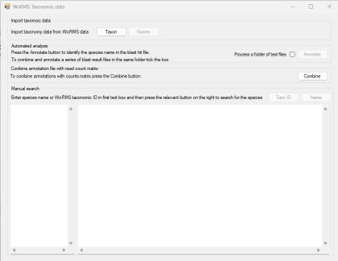

# Taxonomy_WoRMS

#### Contents
- [Introduction](#Introduction)
- [Guide](#guide)
- [Download](#download)
- [Running on macOS, Linux and BSD PCs](#running-on-macos-linux-or-bsd-computers)

## Introduction



```Taxonomic WoRMS``` is designed to annotate a Blast hit results file with each query sequence's description used to search a local copy of the WoRMS taxonomy data. Once annotated the blast hit file can then be combined to a read count matrix file such that the resultant file contains both the sequences read counts in an array of samples and the likely taxonomic origin of the sequence. 

```Taxonomic WoRMS``` is written to be flexible and so can process sequence descriptors from a range of sources such as the SILVA data set or standard GenBank sequence description. The only requirement for automated analysis is that the the descriptions have a roughly consist format.

As well as allowing the automated annotation of a file, ```Taxonomic WoRMS``` will also allow you to perform manual searchers using either names (common English or Latin) or the species' WoRMS taxonomy ID number. 


## Guide

The ```Taxonomic WoRMS``` guide is [here](Guide/README.md).

## Download

The compiled program can be downloaded from [here](Program/).

## Running on macOS, Linux or BSD computers

```Taxonomic WoRMS``` can run on arrange of non-Windows PCs as described [here](Running_Linux_and_macOS/README.md).

