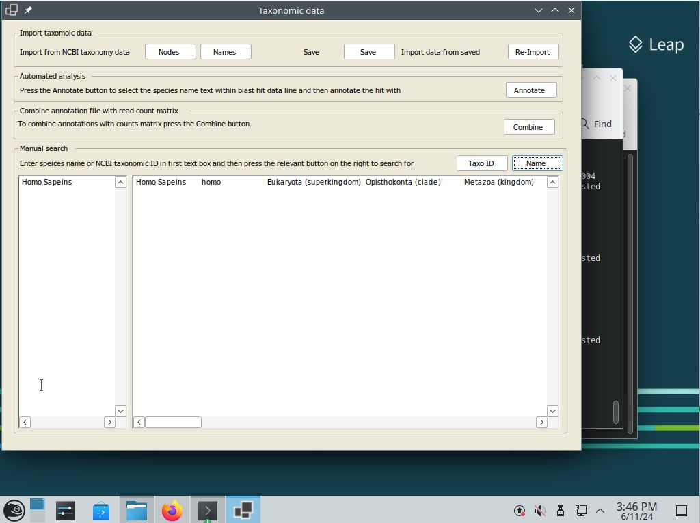
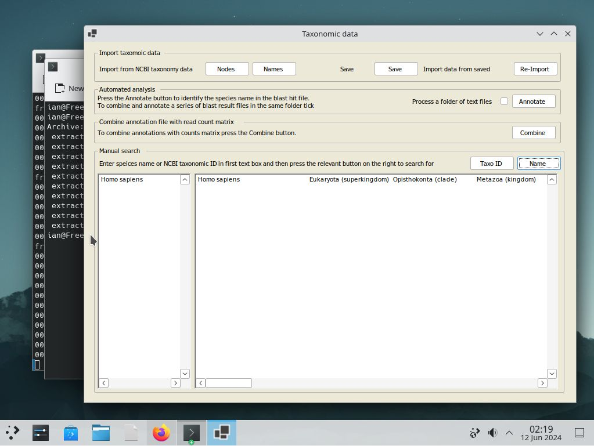
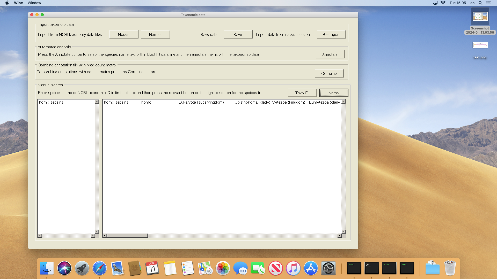

# ```Taxonomy WoRMS``` on macOS and Linux using Wine

While ```Taxonomy WoRMS``` is targeted to run on Windows computers it is possible to run it on a range of Linux (Figure 1), BSD (Figure 2) and Apple computers (Figure 3) using Wine as described here:

* [Running Windows programs on Linux or masOS](https://github.com/msjimc/RunningWindowsProgramsOnLinux).



Figure 1: ```Taxonomy WoRMS``` running on a OpenSUSE - Leap (15.5) using Wine

<hr />



Figure 2: ```Taxonomy WoRMS``` running on a FreeBSD - 14.0_RELEASE using Wine

<hr />



Figure 3: ```Taxonomy WoRMS``` running on a 2012 Mac mini using Wine

<hr />